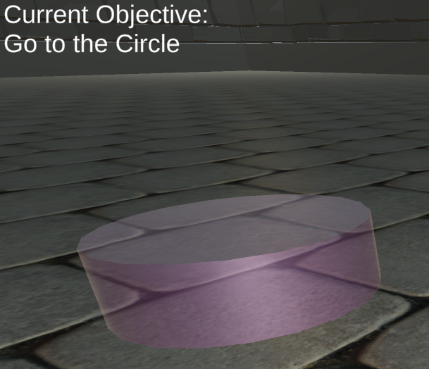
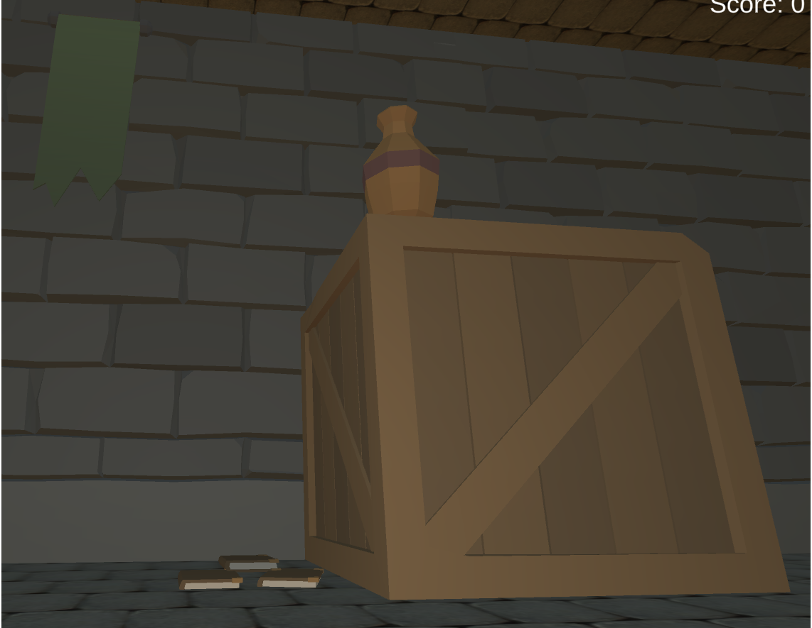
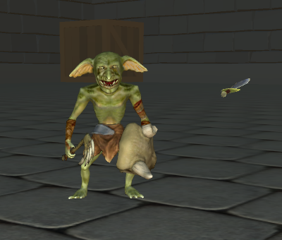
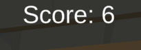

# Unity Capstone Project for Epicodus
#### Project by Elliot McGonigal
## Description
This is a game in Unity where you complete tasks to get a higher score. It is fantasy themed with a goblin and a baby dragon making an appearance.
## Technologies Used
* C#
* Unity
* Unity Editor
* Git
* VSCode

## Known Bugs/Issues
- The sword can disappear in the pillar and complete the pillar task.
- The goblin's movement is super weird and jittery.
- No pop-up when you complete a task, so it is sometimes confusing when you get two tasks in a row.

## License
GNU gpl 3.0 view LICENSE for more details

## How to play the game!
1. Open this project using Unity editor version 2021.3.9f1
2. Launch the game by clicking the play button.
3. In the top left is your first objective. 
4. Take a look around the room, as you complete tasks, new ones will appear. 
5. Now let's complete a few tasks, maybe you'll encounter this guys here. Slay him with the sword in the middle of the room. 
6. Now that you've done some tasks take a look at the top right and see what your score is. How high can you get? 

### Research & Planning Log
#### Sunday, 11/6
* 0:00: Starting Capstone proposal
* 0:30: Finishing Capstone proposal
* 0:55: Watch Video on basic movement in 3d
* 1:20: Watch Video on using basic shooting in Unity
* 1:55: Watch follow up video on shooting tutorial
* 1:25(DST): Watch Video on collision with objects
* 2:30: Watch part 2 and 3 of collision
* 3:15: Read over some of Unity docs on Collision

#### Sunday 11/27
* 3:00 - 3:50: Set up git ignore, set up new 3d unity project, get project to properly add and commit with git, struggle with git for 20 minutes, finally get it to work
* 3:50 - 4:40 learn more about movement through a tutorial, learn that it differs from VR movement a lot more than I had realized, much to learn and should be fun to implement
* https://www.youtube.com/watch?v=VaJseHy_iI4&list=PLS7jk2aVN8G4b-uuf-M0_fhQjL7KEmQwU found good tutorial series to reference - has up to date info rather than the years old out of date stuff in a lot of tutorials
* 6:40: Read about input systems - https://docs.unity3d.com/ScriptReference/Input.html
* 7:10: Try and get movement working, but it's still very janky

#### Sunday 12/11 - Tuesday 12/13
* Went through series on movement after learning that the one I learned did not work with the form of score keeping I was trying to use. https://www.youtube.com/@Yeahlowflicker - 4 hours
* Learned more about collision on Unity https://docs.unity3d.com/Manual/CollidersOverview.html   -  1 hour
* Learned how to get others scripts to see my functions. https://docs.unity3d.com/ScriptReference/Input.html   -  3 hours